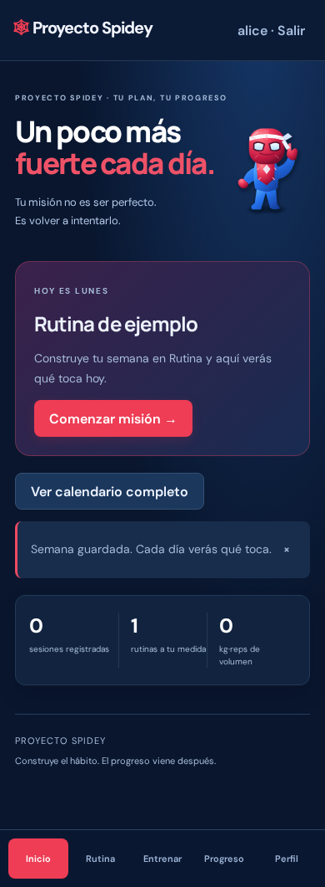
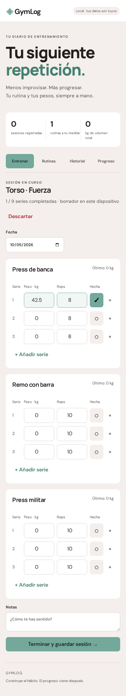
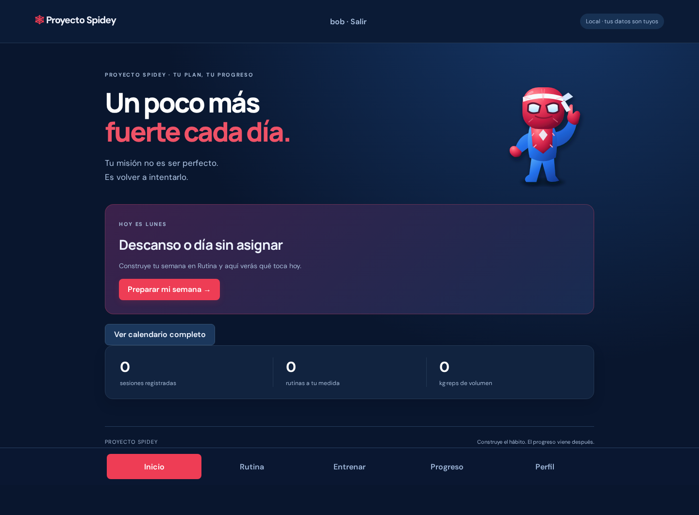
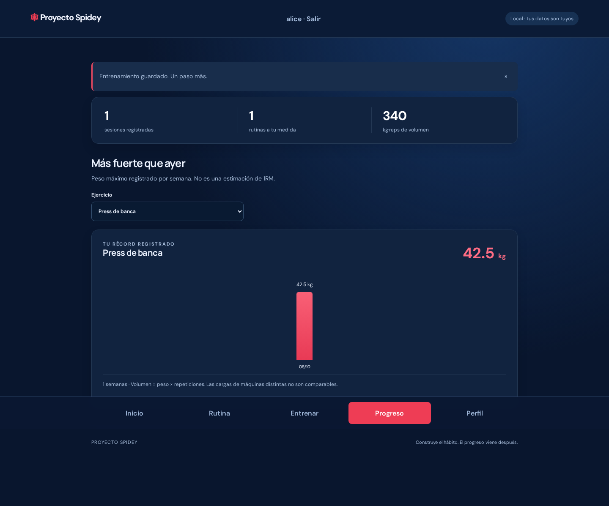

# Proyecto Spidey

**Un poco más fuerte cada día.** Un diario de entrenamiento multiusuario mobile-first en español, construido con **Java 21 + Spring Boot 4 + Angular 22**.

Rutinas, pesos por serie y progreso sin hojas de cálculo. Proyecto de portfolio con API REST, persistencia SQL, validación y pruebas de extremo a extremo.

## Capturas

Las capturas usan datos de prueba, no registros personales. El avatar de Inicio es la figura proporcionada por Samuel, recortada con fondo transparente y optimizada en WebP. Tiene una animación suave que se desactiva con la preferencia de movimiento reducido.

| Inicio móvil | Entrenamiento móvil |
| --- | --- |
|  |  |




## Qué puedes hacer

- Crear una cuenta e iniciar/cerrar sesión. Cada cuenta empieza vacía y sus datos están aislados.
- Inicio con "HOY ES LUNES" y la rutina asignada a ese día.
- Plan semanal por día de la semana y calendario mensual con excepciones por fecha.
- Avatar motivacional personalizado. No es un asesor médico ni un chatbot IA.
- Subir una foto: OCR local gratis con Tesseract.js y modelo español incluido. La imagen no se envía a una API. El texto se convierte en borradores por día que debes revisar y guardar uno a uno.
- Pegar texto o importar rutinas JSON si prefieres no subir una imagen.
- Crear, editar y borrar rutinas con ejercicios, series, rangos de cantidad, unidades (reps/metros/segundos), por lado y RIR objetivo.
- Iniciar una sesión con los últimos pesos registrados precargados.
- Registrar peso en kg, cantidad y RIR real de cada serie; añadir o quitar series.
- Marcar series completadas. Solo esas se guardan al terminar.
- Recuperar una sesión en curso al recargar, gracias al borrador local.
- Elegir la fecha y añadir notas.
- Consultar el historial completo y borrar una sesión con confirmación.
- Ver el mayor peso de cada semana (lunes a domingo) por ejercicio y tu marca más alta registrada.
- Consultar volumen total (kg × repeticiones, solo ejercicios de reps; no incluye metros/segundos) y exportar un backup JSON.

**No incluye** recuperación de contraseña, verificación de email, importación de backups de historial, recomendaciones médicas ni estimaciones de 1RM. No hay rutina personal precargada. Cada persona crea la suya. El OCR puede omitir líneas o leer mal cifras y nunca guarda sin revisión. No es Gemini ni un modelo generativo. El peso de una máquina no se debe comparar con otra. Los ejercicios se agrupan por nombre exacto: renombrarlos separa sus series en el gráfico.

## Arranque rápido

### Opción A: Docker

```bash
docker compose up --build
```

Abre **http://127.0.0.1:8080**. El volumen `gym-data` conserva la base al recrear el contenedor. No ejecutes `docker compose down -v` si quieres conservar los datos.

### Opción B: Java + Node

Requisitos: **JDK 21**, **Node 22.22 o superior** y npm. Maven viene incluido mediante Maven Wrapper.

```bash
./scripts/build.sh
java -jar backend/target/gymlog-1.0.0.jar
```

Abre **http://127.0.0.1:8080**. Angular se sirve desde el propio JAR: una sola aplicación y un mismo origen.

La primera compilación necesita internet para las dependencias. La base H2 queda en `./data/gymlog.mv.db`, relativa al directorio desde el que arrancas Java. Ejecuta siempre desde el mismo lugar.

### Desarrollo con recarga

Terminal 1:

```bash
cd backend
./mvnw spring-boot:run
```

Terminal 2:

```bash
cd frontend
npm ci
npm start
```

Abre **http://127.0.0.1:4200**. El proxy de Angular envía `/api/**` a Spring Boot. No hace falta CORS abierto.

## Pruebas

```bash
cd backend && ./mvnw test
cd ../frontend && npm ci && npm test
npx playwright install chromium
npm run test:e2e
```

- **18 pruebas Java**: validación, pesos decimales, rutinas, edición, borrado, historial y errores 404.
- **12 pruebas unitarias frontend**: volumen, récord, pesos cero, decimales, entradas inválidas y parser OCR de días/rangos/unidades.
- **E2E Playwright** contra Spring Boot real: registro, cookies de sesión, calendario, sesión de entrenamiento, recuperar borrador, historial/gráfico, logout y segunda cuenta. Comprueba aislamiento y acceso por ID ajeno denegado.
- Verifica ausencia de desbordamiento horizontal en 320, 390, 768 y 1440 px, y errores de consola.
- CI ejecuta compilación, pruebas y E2E. No se ha simulado un resultado de CI remoto.

El E2E usa base en memoria y puertos 18081/14200, no tu base de entrenamiento. Genera capturas en `docs/`. Con `OCR_IMAGE=/ruta/foto.jpg PRODUCTION=1 npm run test:e2e` comprueba OCR local y ejecución sobre el JAR con CSP. El modelo español y WASM se incluyen en `frontend/public/ocr/`; la foto de Samuel no está en el repositorio.

## Arquitectura

```text
Angular + Forms
      │ fetch JSON, mismo origen
      ▼
REST controller ── Jakarta Validation
      │
Servicio transaccional
      │ JDBC + consultas parametrizadas
      ▼
H2 persistente (archivo local)
```

```text
backend/src/main/java/com/samilz/gymlog/
  GymLogApplication.java   Entrada Spring Boot
  GymController.java      API REST
  GymService.java         Reglas y transacciones
  Models.java             DTOs y validación
  SecurityConfig.java     Sesiones, CSRF y cabeceras
  AuthController.java     Registro/login/logout
backend/src/main/resources/
  schema.sql              Tablas y claves foráneas
frontend/src/
  main.ts                 Estado y flujos de UI
  app.html                Plantillas accesibles
  styles.css              Diseño responsive
  metrics.mjs             Funciones puras probadas
```

### API

| Método | Ruta | Función |
| --- | --- | --- |
| GET | `/api/auth/csrf` | Token CSRF |
| POST | `/api/auth/register` | Crear cuenta |
| POST | `/api/auth/login` | Entrar |
| POST | `/api/auth/logout` | Salir |
| GET | `/api/auth/me` | Usuario actual |
| PUT | `/api/weekly` | Plan semanal |
| PUT | `/api/plans` | Excepción por fecha |
| GET | `/api/state` | Rutinas e historial |
| POST | `/api/routines` | Crear rutina |
| PUT | `/api/routines/{id}` | Reemplazar rutina |
| DELETE | `/api/routines/{id}` | Borrar rutina; conserva historial |
| POST | `/api/workouts` | Guardar sesión |
| DELETE | `/api/workouts/{id}` | Borrar sesión |

Los ID se generan en el servidor. Las escrituras son transaccionales. Se validan listas anidadas, fechas no futuras, longitudes, series, repeticiones y pesos (0–1000 kg, hasta 2 decimales). Las consultas usan parámetros, no concatenación de entrada del usuario.

## Privacidad y despliegue

Cuentas independientes, **BCrypt coste 12** para contraseñas, sesión server-side, cookie HttpOnly + SameSite Strict, protección CSRF en escrituras y consultas SQL parametrizadas. El ID del usuario procede de la sesión, nunca del cuerpo de la petición. Las rutas de rutinas, sesiones y planes verifican propietario. Limitación simple de intentos: 20 por IP en 15 minutos, en memoria del proceso. No usarlo como único sistema antiabuso de producción.

Usuarios: 3–40 caracteres (`a-z`, números, `_`, `-`, `.`), normalizados a minúsculas. Contraseña: 12–72 caracteres y máximo 72 bytes UTF-8 por BCrypt. No hay recuperación de contraseña todavía. No hay cuenta de administrador ni contraseña precargada.

El servidor escucha en **127.0.0.1** por defecto y Compose solo publica en localhost. No hay hosting contratado, publicación online ni gastos. Las pruebas han verificado el JAR; Docker está preparado pero no se ha ejecutado aquí.

Antes de alojarlo para otras personas: HTTPS, `COOKIE_SECURE=true`, proxy seguro, backups, política de privacidad, recuperación de cuentas, límites de registro/almacenamiento, revisión de dependencias y una base de datos administrada. Las sesiones están en memoria: reiniciar el servidor cierra sesiones. H2 sirve para un proceso pequeño, no para múltiples instancias. Se ha probado aislamiento funcional, no se ha hecho una auditoría de seguridad independiente. No afirmar que es invulnerable.

Variables: `BIND_ADDRESS`, `PORT`, `DB_URL`, `DB_PASSWORD`, `COOKIE_SECURE`. No poner claves en Git. Cambiar el bind a `0.0.0.0` hace accesible el servidor a la red; no hacerlo sin preparar seguridad de despliegue.

Los borradores quedan en localStorage con clave por usuario; no están cifrados y pueden permanecer al salir. Evita dispositivos compartidos. El JSON exportado contiene tus sesiones: guárdalo en privado. La exportación de historial no tiene restauración automática. Copia el archivo H2 solo con el servidor apagado.

El OCR funciona en tu navegador, usando ficheros locales servidos por la app; no lleva API key ni factura por foto. Está basado en reconocimiento de texto y expresiones de series/rangos, no entiende cualquier diseño de rutina como un chatbot. Revisa todos los borradores. Las fuentes se descargan desde Google Fonts, con fallback de sistema.

La v2 usa tablas nuevas por usuario. **No migra automáticamente el historial anónimo de v1**: no se asigna a una cuenta sin confirmar propietario. Guarda tu backup v1 antes de cambiar.

## Siguiente versión

- Recuperación de contraseña, verificación y administración de cuentas.
- Restauración validada de backups JSON.
- ID estables de ejercicios para mantener progreso al renombrarlos.
- Paginación y estadísticas semanales para historiales grandes.
- Temporizador de descansos y PWA offline.
- Chatbot con proveedor elegido por el usuario, solo tras confirmar privacidad y coste.

## Créditos

Proyecto personal sin ánimo de lucro, hecho por fans; no afiliado a Marvel/Disney. Spider-Man y su imagen pertenecen a sus dueños. Código libre.

La imagen personalizada y los personajes, marcas y recursos de terceros no quedan liberados por este aviso. El repositorio permanece privado hasta que Samuel revise y autorice su publicación.

## Backend gratuito con datos persistentes

El proyecto incluye driver PostgreSQL y SQL compatible, probado con PostgreSQL 14 real en E2E. Para Render Free usa el Dockerfile, `SPRING_PROFILES_ACTIVE=prod`, `DB_URL=jdbc:postgresql://HOST/BASE?sslmode=require`, `DB_USERNAME` y `DB_PASSWORD` como secretos de entorno. No uses H2 sobre disco efímero para datos que quieras conservar. El proceso permite ajustar `JAVA_TOOL_OPTIONS=-XX:MaxRAMPercentage=70.0` para memoria limitada.

Fuentes oficiales consultadas: https://render.com/docs/free y https://neon.com/pricing . Render Free duerme tras 15 minutos y su Postgres gratuito caduca en 30 días. Neon Free no es una prueba temporal, no exige tarjeta y tiene límites de cómputo/almacenamiento; revisa sus condiciones actuales antes de crear el servicio. No se incluyen credenciales ni una base ajena en el proyecto.
