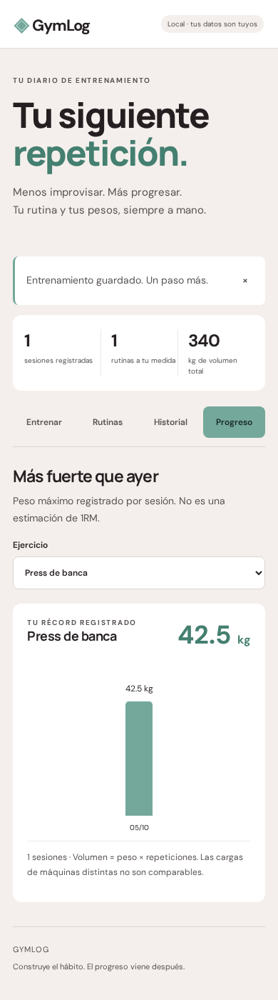

# GymLog

**Tu siguiente repetición.** Un diario de entrenamiento mobile-first en español, construido con **Java 21 + Spring Boot 4 + Angular 22**.

Rutinas, pesos por serie y progreso sin hojas de cálculo. Proyecto de portfolio con API REST, persistencia SQL, validación y pruebas de extremo a extremo.

## Capturas

Datos ilustrativos, no registros personales.

| Registro móvil | Progreso móvil |
| --- | --- |
|  |  |


## Qué puedes hacer

- Crear, editar y borrar rutinas con ejercicios, series y repeticiones objetivo.
- Iniciar una sesión con los últimos pesos registrados precargados.
- Registrar peso en kg y repeticiones de cada serie; añadir o quitar series.
- Marcar series completadas. Solo esas se guardan al terminar.
- Recuperar una sesión en curso al recargar, gracias al borrador local.
- Elegir la fecha y añadir notas.
- Consultar el historial completo y borrar una sesión con confirmación.
- Ver el mayor peso de cada sesión por ejercicio y tu marca más alta registrada.
- Consultar volumen total (kg × repeticiones) y exportar un backup JSON.
- Probar la interfaz sin API con `?demo=1`: persistencia solo en el navegador.

**No incluye** cuentas, sincronización entre dispositivos, importación JSON, recomendaciones médicas ni estimaciones de 1RM. El peso de una máquina no se debe comparar con otra. Los ejercicios se agrupan por nombre exacto: renombrarlos separa sus series en el gráfico.

## Arranque rápido

### Opción A: Docker

```bash
docker compose up --build
```

Abre **http://127.0.0.1:8080**. El volumen `gym-data` conserva la base al recrear el contenedor. No ejecutes `docker compose down -v` si quieres conservar los datos.

### Opción B: Java + Node

Requisitos: **JDK 21**, **Node 22.22 o superior** y npm. Maven viene incluido mediante Maven Wrapper.

```bash
./scripts/build.sh
java -jar backend/target/gymlog-1.0.0.jar
```

Abre **http://127.0.0.1:8080**. Angular se sirve desde el propio JAR: una sola aplicación y un mismo origen.

La primera compilación necesita internet para las dependencias. La base H2 queda en `./data/gymlog.mv.db`, relativa al directorio desde el que arrancas Java. Ejecuta siempre desde el mismo lugar.

### Desarrollo con recarga

Terminal 1:

```bash
cd backend
./mvnw spring-boot:run
```

Terminal 2:

```bash
cd frontend
npm ci
npm start
```

Abre **http://127.0.0.1:4200**. El proxy de Angular envía `/api/**` a Spring Boot. No hace falta CORS abierto.

## Pruebas

```bash
cd backend && ./mvnw test
cd ../frontend && npm ci && npm test
npx playwright install chromium
npm run test:e2e
```

- **11 pruebas Java**: validación, pesos decimales, rutinas, edición, borrado, historial y errores 404.
- **6 pruebas unitarias frontend**: volumen, récord, pesos cero, decimales y entradas inválidas.
- **E2E Playwright** contra Spring Boot real: crear rutina, iniciar sesión, recuperar borrador, guardar series completadas, historial, gráfico, editar y rechazo de pesos negativos.
- Verifica ausencia de desbordamiento horizontal en 320, 390, 768 y 1440 px, y errores de consola.
- CI ejecuta compilación, pruebas y E2E. No se ha simulado un resultado de CI remoto.

El E2E usa base en memoria y puertos 18081/14200, no tu base de entrenamiento. Genera capturas en `docs/`.

## Arquitectura

```text
Angular + Forms
      │ fetch JSON, mismo origen
      ▼
REST controller ── Jakarta Validation
      │
Servicio transaccional
      │ JDBC + consultas parametrizadas
      ▼
H2 persistente (archivo local)
```

```text
backend/src/main/java/com/samilz/gymlog/
  GymLogApplication.java   Entrada Spring Boot
  GymController.java      API REST
  GymService.java         Reglas y transacciones
  Models.java             DTOs y validación
backend/src/main/resources/
  schema.sql              Tablas y claves foráneas
frontend/src/
  main.ts                 Estado y flujos de UI
  app.html                Plantillas accesibles
  styles.css              Diseño responsive
  metrics.mjs             Funciones puras probadas
```

### API

| Método | Ruta | Función |
| --- | --- | --- |
| GET | `/api/state` | Rutinas e historial |
| POST | `/api/routines` | Crear rutina |
| PUT | `/api/routines/{id}` | Reemplazar rutina |
| DELETE | `/api/routines/{id}` | Borrar rutina; conserva historial |
| POST | `/api/workouts` | Guardar sesión |
| DELETE | `/api/workouts/{id}` | Borrar sesión |

Los ID se generan en el servidor. Las escrituras son transaccionales. Se validan listas anidadas, fechas no futuras, longitudes, series, repeticiones y pesos (0–1000 kg, hasta 2 decimales). Las consultas usan parámetros, no concatenación de entrada del usuario.

## Privacidad y despliegue

**V1 es una app personal local, no un servicio multiusuario. No publiques la API en internet sin añadir autenticación y autorización.**

El servidor escucha en `127.0.0.1` por defecto y Compose solo publica el puerto en localhost. H2 Console no está habilitada. No hay credenciales, tokens ni registros reales en el código. Las fuentes tipográficas se cargan desde Google Fonts; hay fuentes de sistema de respaldo si no hay internet.

`BIND_ADDRESS`, `PORT`, `DB_URL` y `DB_PASSWORD` se pueden configurar por entorno. Cambiar el bind a `0.0.0.0` fuera del contenedor expone la API a la red: todos los visitantes tendrían acceso a todos los datos. El borrador y la demo se guardan en el navegador sin cifrado; no los uses en un equipo compartido.

El JSON exportado contiene tus sesiones: guárdalo en privado. También puedes hacer copia del archivo H2 **con el servidor apagado**. La exportación JSON es de consulta/backup, no tiene restauración automática en esta versión.

No hay hosting contratado ni pagos. El Dockerfile está preparado, pero se debe probar en un equipo con Docker y configurar seguridad antes de un despliegue remoto.

## Siguiente versión

- Autenticación, perfiles y sincronización segura.
- Restauración validada de backups JSON.
- ID estables de ejercicios para mantener progreso al renombrarlos.
- Paginación y estadísticas semanales para historiales grandes.
- Temporizador de descansos y PWA offline.

## Créditos

Proyecto preparado para el portfolio de Samuel Lozano. Sin licencia abierta añadida: publicar el código para consulta no concede por sí solo permiso para reutilizarlo.
